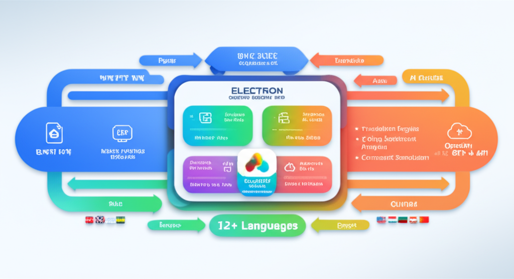

# 자막 번역기 (Subtitle Translator)

한국어 자막을 영어 및 다국어로 번역하는 Electron 데스크톱 앱

## Download

[](https://github.com/NachunBae2/subtitle-translator/releases/latest/download/자막.번역기_0.2.6_x64.dmg)

**[최신 릴리즈 다운로드 (v0.2.6)](https://github.com/NachunBae2/subtitle-translator/releases/latest)**

> macOS용 DMG 파일입니다. 다운로드 후 Applications 폴더에 드래그하여 설치하세요.

## Features

- **한국어 → 영어 번역**: GPT-4 기반 고품질 번역
- **영어 → 다국어 번역**: 일본어, 중국어(간체/번체), 스페인어, 프랑스어, 독일어, 포르투갈어, 러시아어, 아랍어, 힌디어, 태국어, 베트남어, 인도네시아어
- **2단계 감성 분석**: GPT가 레이블(긍정/중립/부정/매우부정) 평가 후 범위 내 점수 산출
- **글로벌 댓글 시뮬레이션**: 콘텐츠에 대한 다국적 반응 예측
- **용어집 관리**: 도메인별 용어집 및 프리셋 지원

## Architecture



## Tech Stack

- **Frontend**: React 18 + TypeScript + Vite
- **Desktop**: Electron
- **State**: Zustand
- **AI**: OpenAI GPT-4 API
- **Charts**: Recharts

## Installation

```bash
# Dependencies
npm install

# Development
npm run electron:dev

# Build
npm run electron:build
```

## Project Structure

```
src/
├── app/                 # App entry
├── components/          # UI components
│   ├── layout/         # Header, Sidebar, etc.
│   └── ui/             # Button, Card, Input, etc.
├── features/           # Feature modules
│   ├── translate/      # Korean → English
│   ├── review/         # Translation review
│   ├── multilang/      # Multi-language
│   ├── dashboard/      # AI Analysis
│   └── settings/       # Settings
├── lib/                # Core utilities
│   ├── translator.ts   # GPT translation
│   ├── srt.ts          # SRT parser
│   └── chunker.ts      # Text chunking
└── stores/             # Zustand stores
```

## License

Private - Internal Use Only
